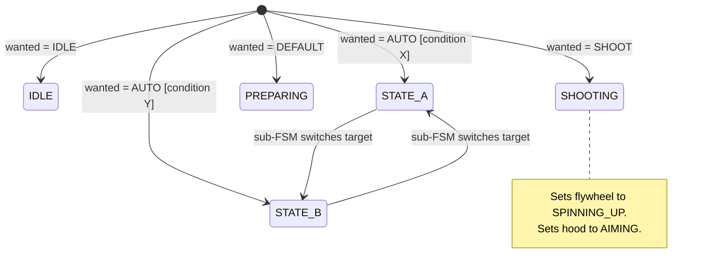

# FSM Extractor Skill

Analyze source code to extract finite state machine patterns and generate interactive Mermaid diagram viewers. Identifies and isolates multiple independent FSMs in a codebase, producing a separate diagram and viewer for each.

## Input

The user will provide a path to analyze: $ARGUMENTS

If no path is provided, use the current working directory.

## Steps

### 1. Find source files

Use the Glob tool to find source files in the target path. Search for these patterns:
- `**/*.py`
- `**/*.js`
- `**/*.ts`
- `**/*.cpp`
- `**/*.c`
- `**/*.java`
- `**/*.cs`
- `**/*.go`
- `**/*.rs`

Exclude files in `node_modules`, `venv`, `.venv`, `build`, `dist`, `.git`, `__pycache__`, and `target` directories.

### 2. Read the files

Read each matching file. Skip files that are clearly not relevant (e.g., config files, lock files, generated code). If there are many files (>15), prioritize files whose names suggest state logic: files containing words like "state", "controller", "machine", "fsm", "robot", "handler", "manager", "engine", or "mode".

### 3. Identify and isolate distinct FSMs

Analyze the code to find ALL separate state machines. A codebase often contains multiple independent FSMs. Identify each one separately by looking for:

- Explicit state variables or enums (e.g., `state = "IDLE"`, `State.RUNNING`, `enum State`)
- State transition functions (e.g., `transition_to()`, `setState()`, `changeState()`)
- Switch/case statements on state variables
- If/else chains checking state
- Event handlers that change state
- Robot control states (idle, moving, stopped, error, etc.)
- State pattern implementations (classes per state)
- Flags that form implicit states (e.g., `is_moving`, `is_paused`, `has_error`)

For each FSM you find, record:
- A short descriptive name (e.g., "NavigationController", "GripperStateMachine", "ConnectionManager")
- Which files and code sections it spans
- Its states and transitions
- How it is independent from or interacts with other FSMs in the codebase
- **Its transition model** (see below)

#### Classify the transition model

For each FSM, determine whether it is **event-driven** or **wanted-state-driven**:

- **Event-driven FSM**: The current state determines which transitions are possible. Transitions depend on the current state (e.g., you can only go from SPINNING_UP to AT_SETPOINT, not directly from OFF to AT_SETPOINT). These are true graph-structured state machines.

- **Wanted-state-driven FSM** (also called "input-mapped" or "selector" FSMs): The internal state is re-computed every cycle as a pure function of an external "wanted state" input variable, with little or no dependence on the previous internal state. Any internal state can transition to any other internal state on the next cycle simply by changing the wanted input. These are common in robotics superstructure/orchestrator patterns where a switch statement maps a `wantedState` enum directly to a `currentState` enum.

  Signs of a wanted-state-driven FSM:
  - A `wantedState` / `desiredState` variable separate from `currentState`
  - An `updateState()` method that switches on `wantedState` and assigns `currentState` with no conditional logic based on `previousState` or `currentState`
  - Every branch of the switch unconditionally sets `currentState` regardless of what it was before
  - The state machine has no "memory" — it doesn't matter what state you were in before, only what the wanted input is now

  **Important**: A wanted-state-driven FSM may still have *one or two* branches that use conditional logic (e.g., an AUTO mode that checks robot position to decide between two states). These are still fundamentally wanted-state-driven — the conditional is on external data, not on the FSM's own history.

Two state machines are **separate** if they:
- Use different state variables or enums
- Live in different classes, modules, or subsystems
- Can transition independently of each other

Two state machines should be **combined** only if they:
- Share the same state variable
- Are tightly coupled with transitions that depend on each other's state

### 4. Generate Mermaid diagrams

For **each** identified FSM, produce a `stateDiagram-v2` Mermaid diagram that captures:
- All identified states for that FSM
- Transitions between states, labeled with the events/conditions that trigger them
- Start state (`[*] --> InitialState`)
- End states if applicable (`FinalState --> [*]`)
- Use clear, descriptive PascalCase state names
- Add notes for complex states if needed
- If two FSMs interact (one triggers transitions in another), add a note on the relevant transition indicating the cross-FSM dependency

#### Mermaid syntax rules
- **Never use parentheses** `()` in transition labels — they can break Mermaid parsing. Use square brackets `[condition]` or rephrase without special characters.
- Keep transition labels concise — use short trigger names, not full sentences.

#### Diagramming wanted-state-driven FSMs

For **wanted-state-driven FSMs**, do NOT draw N² transitions between every pair of internal states. Since any state can transition to any other state by changing the wanted input, showing all possible edges creates a cluttered, uninformative diagram that implies false constraints.

Instead, use this pattern:
1. Show a central **choice node** or **start hub** representing the wanted-state input
2. Draw transitions from `[*]` to each internal state, labeled with the wanted-state value that produces it
3. For branches with conditional logic (e.g., AUTO mode that resolves to different states based on external data), show those as branching transitions with the condition
4. Use notes on states to describe what actions/outputs each internal state triggers (e.g., which subsystem states it sets)
5. If there are any history-dependent transitions within specific branches (e.g., AUTO_CYCLE switches between HUB and OUTPOST based on a sub-FSM), show only those specific transitions between the affected states

Example structure for a wanted-state-driven FSM:


This approach clearly communicates that the FSM is a **selector** — the wanted input chooses the state — rather than implying sequential state-to-state transitions that don't actually exist in the code.

#### Diagramming event-driven FSMs

For **event-driven FSMs**, draw the actual state graph showing only the transitions that are possible from each state. These diagrams should show the true topology — which states can reach which other states and under what conditions.

### 5. Write output files

Create an output directory called `fsm-output` inside the target path (or current working directory if none was given).

For **each** FSM identified, write two files using a kebab-case version of the FSM name:

**a) `fsm-output/<fsm-name>.mmd`** — the raw Mermaid diagram code for that FSM.

**b) `fsm-output/<fsm-name>.html`** — a self-contained interactive HTML viewer for that FSM.

If only one FSM is found, name the files `state-machine.mmd` and `view-diagram.html`.

Also write **c) `fsm-output/index.html`** — a landing page that links to all the individual viewers, showing each FSM's name and a brief description. Use this template, replacing `%%FSM_LIST%%` with an `<li>` for each FSM:

```html
<!doctype html>
<html>
  <head>
    <meta charset="UTF-8" />
    <title>State Machines</title>
    <style>
      body {
        font-family: -apple-system, BlinkMacSystemFont, "Segoe UI", sans-serif;
        margin: 0;
        padding: 48px 24px;
        background: #fff;
        color: #1a1a1a;
      }
      .container {
        max-width: 720px;
        margin: 0 auto;
      }
      h1 {
        font-size: 24px;
        font-weight: 600;
        margin: 0 0 4px;
      }
      .subtitle {
        color: #666;
        font-size: 13px;
        margin: 0 0 32px;
      }
      .fsm-list {
        list-style: none;
        padding: 0;
        margin: 0;
      }
      .fsm-list li {
        padding: 16px 0;
        border-bottom: 1px solid #e5e5e5;
      }
      .fsm-list li:first-child {
        border-top: 1px solid #e5e5e5;
      }
      .fsm-list a {
        text-decoration: none;
        color: #0969da;
        font-size: 16px;
        font-weight: 500;
      }
      .fsm-list a:hover {
        text-decoration: underline;
      }
      .fsm-desc {
        color: #555;
        font-size: 14px;
        margin-top: 4px;
        line-height: 1.4;
      }
      .fsm-files {
        color: #888;
        font-size: 12px;
        margin-top: 4px;
        font-family: ui-monospace, "SF Mono", Menlo, monospace;
      }
      footer {
        margin-top: 48px;
        padding-top: 16px;
        border-top: 1px solid #e5e5e5;
        font-size: 12px;
        color: #888;
        display: flex;
        gap: 16px;
      }
      footer a {
        color: #0969da;
        text-decoration: none;
      }
      footer a:hover {
        text-decoration: underline;
      }
    </style>
  </head>
  <body>
    <div class="container">
      <h1>State Machines</h1>
      <p class="subtitle">Extracted from source code</p>
      <ul class="fsm-list">
        %%FSM_LIST%%
      </ul>
      <footer>
        Made by <a href="https://github.com/JRTaylord">JRTaylord</a>
        &middot; <a href="https://www.frc360.com/">Team 360 Website</a>
        &middot; <a href="https://github.com/FRCTeam360">Team 360 GitHub</a>
      </footer>
    </div>
  </body>
</html>
```

Each `<li>` should follow this format:
```html
<li>
  <a href="<fsm-name>.html">FSM Display Name</a>
  <div class="fsm-desc">Brief description of what this state machine controls</div>
  <div class="fsm-files">Files: file1.py, file2.py</div>
</li>
```

For each individual FSM viewer HTML, use this template, replacing `%%MERMAID_DIAGRAM%%` with the Mermaid code and `%%FSM_TITLE%%` with the FSM's display name:

```html
<!doctype html>
<html>
  <head>
    <meta charset="UTF-8" />
    <title>%%FSM_TITLE%% - State Machine Diagram</title>
    <script src="https://cdn.jsdelivr.net/npm/mermaid@11/dist/mermaid.min.js"></script>
    <script src="https://cdn.jsdelivr.net/npm/svg-pan-zoom@3.6.1/dist/svg-pan-zoom.min.js"></script>
    <style>
      * { box-sizing: border-box; }
      body {
        font-family: -apple-system, BlinkMacSystemFont, "Segoe UI", sans-serif;
        margin: 0;
        padding: 0;
        background: #f8f8f8;
        color: #1a1a1a;
      }
      header {
        background: #fff;
        border-bottom: 1px solid #e0e0e0;
        padding: 12px 24px;
        display: flex;
        align-items: center;
        gap: 16px;
      }
      header a {
        color: #555;
        text-decoration: none;
        font-size: 13px;
      }
      header a:hover {
        color: #0969da;
      }
      header h1 {
        font-size: 16px;
        font-weight: 600;
        margin: 0;
      }
      .toolbar {
        margin-left: auto;
        display: flex;
        gap: 8px;
      }
      .toolbar button {
        padding: 6px 12px;
        font-size: 12px;
        font-weight: 500;
        background: #fff;
        border: 1px solid #d0d0d0;
        border-radius: 4px;
        cursor: pointer;
        color: #333;
      }
      .toolbar button:hover {
        background: #f0f0f0;
        border-color: #bbb;
      }
      .links {
        display: flex;
        gap: 12px;
        margin-left: 16px;
        font-size: 12px;
      }
      .links a {
        color: #888;
        text-decoration: none;
      }
      .links a:hover {
        color: #0969da;
      }
      #diagram-container {
        background: #fff;
        padding: 30px;
        overflow: visible;
        width: 90%;
        max-width: 1400px;
        height: 700px;
        margin: 20px auto;
        position: relative;
      }
      #diagram-container svg {
        width: 100%;
        height: 100%;
      }
      .mermaid {
        width: 100%;
        height: 100%;
      }
    </style>
  </head>
  <body>
    <header>
      <a href="index.html">&larr; Back</a>
      <h1>%%FSM_TITLE%%</h1>
      <div class="toolbar">
        <button onclick="downloadSVG()">Export SVG</button>
        <button onclick="downloadPNG()">Export PNG</button>
      </div>
      <div class="links">
        Made by <a href="https://github.com/JRTaylord">JRTaylord</a>
        &middot; <a href="https://www.frc360.com/">Team 360 Website</a>
        &middot; <a href="https://github.com/FRCTeam360">Team 360 GitHub</a>
      </div>
    </header>

    <div id="diagram-container">
      <div class="mermaid">%%MERMAID_DIAGRAM%%</div>
    </div>

    <script>
      mermaid.initialize({
        startOnLoad: true,
        theme: "default",
        securityLevel: "loose",
        flowchart: { useMaxWidth: false },
      });

      let panZoomInstance = null;

      window.addEventListener("load", () => {
        setTimeout(() => {
          const svg = document.querySelector("#diagram-container svg");
          if (svg && typeof svgPanZoom !== "undefined") {
            panZoomInstance = svgPanZoom(svg, {
              zoomEnabled: true,
              controlIconsEnabled: true,
              fit: true,
              center: true,
              minZoom: 0.3,
              maxZoom: 10,
              zoomScaleSensitivity: 0.3,
              dblClickZoomEnabled: true,
              mouseWheelZoomEnabled: true,
              preventMouseEventsDefault: true,
              contain: false,
            });
          }
        }, 500);
      });

      function downloadSVG() {
        const svg = document.querySelector("#diagram-container svg");
        if (!svg) return;
        const blob = new Blob(
          [new XMLSerializer().serializeToString(svg)],
          { type: "image/svg+xml" }
        );
        const a = document.createElement("a");
        a.href = URL.createObjectURL(blob);
        a.download = "%%FSM_TITLE%%.svg";
        a.click();
        URL.revokeObjectURL(a.href);
      }

      function downloadPNG() {
        const svg = document.querySelector("#diagram-container svg");
        if (!svg) return;
        const svgData = new XMLSerializer().serializeToString(svg);
        const img = new Image();
        img.onload = function () {
          const canvas = document.createElement("canvas");
          canvas.width = img.width * 2;
          canvas.height = img.height * 2;
          const ctx = canvas.getContext("2d");
          ctx.fillStyle = "#fff";
          ctx.fillRect(0, 0, canvas.width, canvas.height);
          ctx.drawImage(img, 0, 0, canvas.width, canvas.height);
          canvas.toBlob(function (blob) {
            const a = document.createElement("a");
            a.href = URL.createObjectURL(blob);
            a.download = "%%FSM_TITLE%%.png";
            a.click();
            URL.revokeObjectURL(a.href);
          });
        };
        img.src =
          "data:image/svg+xml;base64," +
          btoa(unescape(encodeURIComponent(svgData)));
      }
    </script>
  </body>
</html>
```

### 6. Report to the user

Tell the user:
- How many FSMs were found and a brief summary of each (name, states, key transitions)
- Each Mermaid diagram in its own ```mermaid code block so they can see them inline
- If FSMs interact with each other, describe the dependencies
- The paths to all output files
- That they can open `index.html` in their browser to navigate between all diagrams, or open any individual viewer directly
